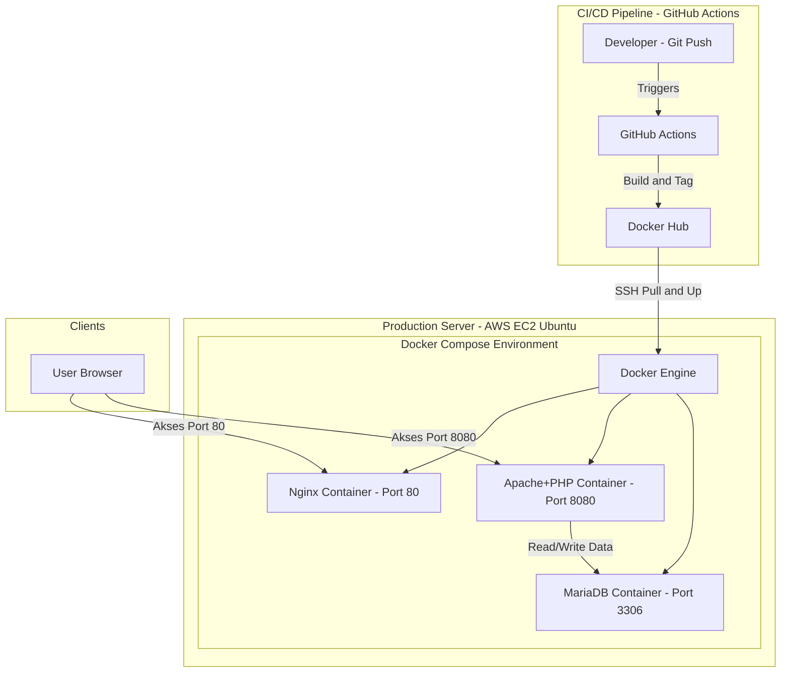
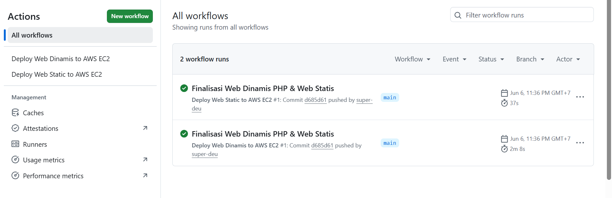
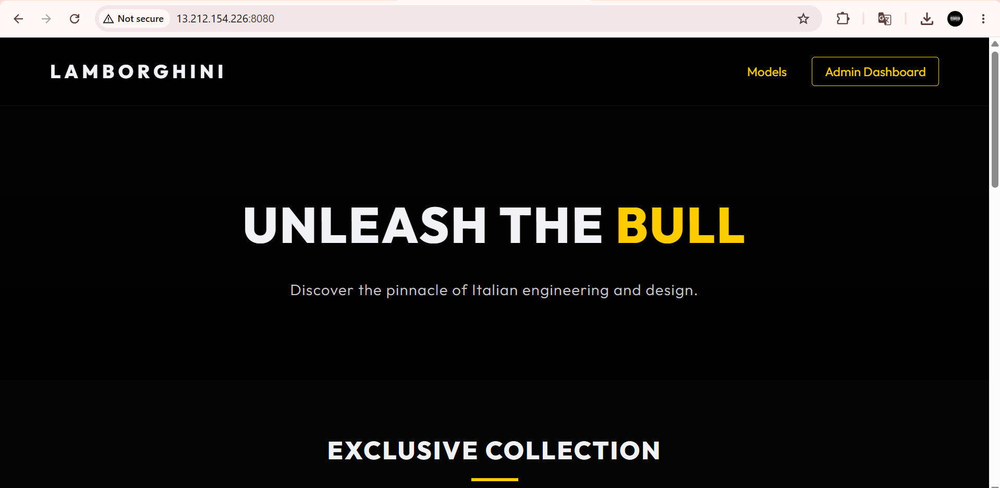

# UAS Arsitektur & Deployment Aplikasi Cloud Native

Repositori ini berisi implementasi *Cloud Native Deployment* yang diotomatisasi penuh menggunakan sistem **Continuous Integration & Continuous Deployment (CI/CD)**. Proyek ini mendemonstrasikan penggelaran dua aplikasi web (Statis & Dinamis) ke dalam *cloud server* (AWS EC2) menggunakan *containerization* (Docker).

## Topologi Arsitektur (Architecture Topology)

Sistem ini didesain menggunakan pendekatan *microservices-lite* di mana setiap komponen terisolasi dalam kontainernya masing-masing, namun saling terhubung dalam satu jaringan *bridge* Docker.

## Penjelasan Environment & Komponen

Proyek ini terdiri dari 3 layanan utama yang dijalankan bersamaan melalui `docker-compose.yml`:

1.  **Web Statis (Port 80) - Nginx**
    *   Berisi halaman portofolio personal (HTML/CSS).
    *   Menggunakan *base image* `nginx:alpine` yang sangat ringan.
2.  **Web Dinamis (Port 8080) - PHP Native (Showroom Lamborghini)**
    *   Berisi sistem CRUD (Create, Read, Update, Delete) untuk manajemen data mobil.
    *   Menggunakan *base image* `php:8.2-apache` dengan ekstensi `mysqli` dan `pdo` yang di-*compile* melalui `Dockerfile`.
3.  **Database Server - MariaDB**
    *   Menggunakan *image* `mariadb:lts`.
    *   Diinisialisasi secara otomatis saat pembuatan kontainer melalui *mounting* file `db_lamborghini.sql` ke direktori `/docker-entrypoint-initdb.d/`.
    *   Kredensial database diinjeksikan secara dinamis melalui *Environment Variables* Docker.

## Alur CI/CD (Continuous Integration / Deployment)

*Deployment* tidak dilakukan secara manual (*zero downtime attempt*). Setiap kali ada *push* ke *branch* `main` yang memengaruhi folder `web-dinamis-php` atau `web-statis`, Github Actions akan:
1. Melakukan *Checkout* kode terbaru.
2. Membangun (*Build*) Docker Image.
3. Mengirimkan (*Push*) Image tersebut ke **Docker Hub**.
4. Melakukan koneksi SSH ke **AWS EC2**.
5. Mengirimkan file konfigurasi `docker-compose.yml` via SCP.
6. Memerintahkan EC2 untuk melakukan `docker compose pull` dan `docker compose up -d`.

## Tautan Langsung (Live Demo)

Silakan kunjungi tautan berikut untuk melihat aplikasi yang sudah berjalan di atas *cloud server* AWS:

*   **Web Statis (Portofolio):** [http://13.212.154.226](http://13.212.154.226)
*   **Web Dinamis (Showroom Lamborghini):** [http://13.212.154.226:8080](http://13.212.154.226:8080)
*   **Halaman Admin CRUD:** [http://13.212.154.226:8080/admin.php](http://13.212.154.226:8080/admin.php)

## Bukti Keberhasilan Implementasi (Screenshots)

Berikut adalah bukti bahwa alur CI/CD dan Deployment telah berjalan dengan sukses:

### 1. Bukti GitHub Actions Sukses (Passed)

*(Keterangan: Screenshot dari tab Actions di GitHub yang menunjukkan ceklis hijau pada proses build dan deploy)*

### 2. Bukti Web Dinamis Berjalan di AWS

*(Keterangan: Screenshot halaman Showroom Lamborghini dan fitur CRUD yang terbuka di browser dengan URL IP AWS)*

### 3. Bukti Web Statis Berjalan di AWS

*(Keterangan: Screenshot halaman Portofolio yang terbuka di browser dengan URL IP AWS)*
